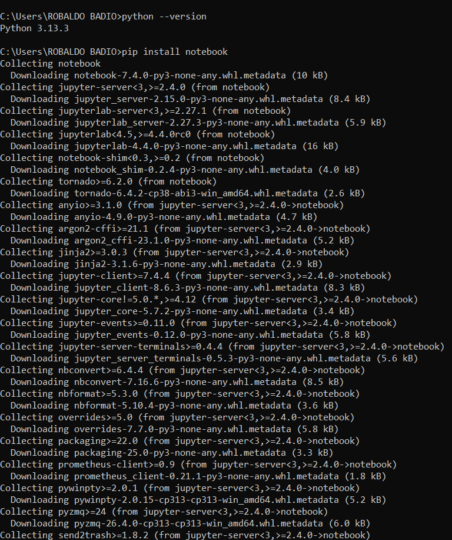
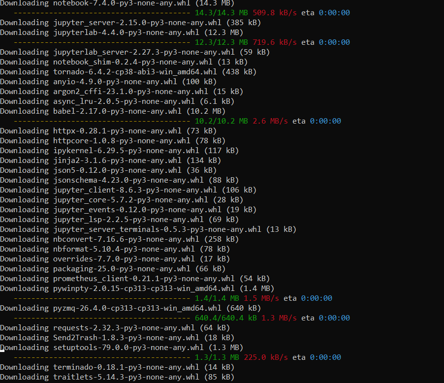
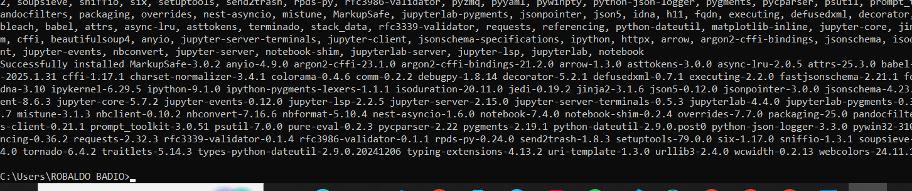
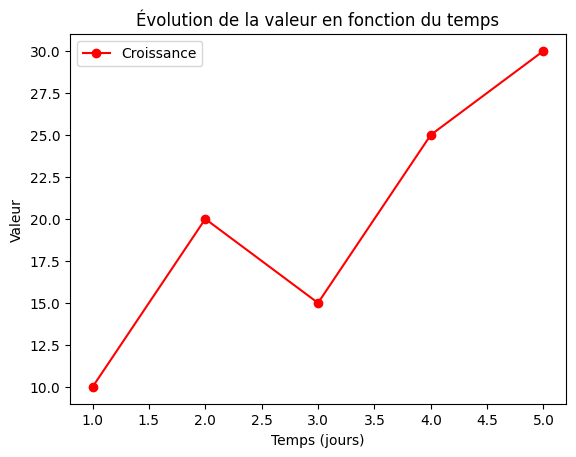
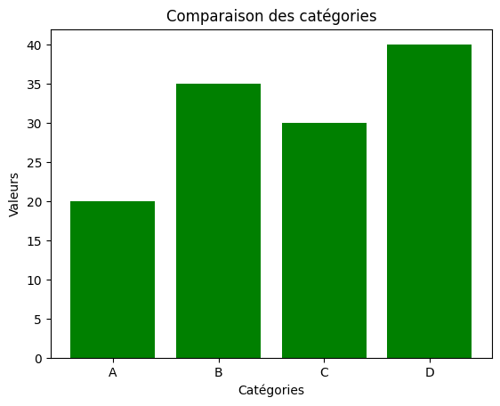
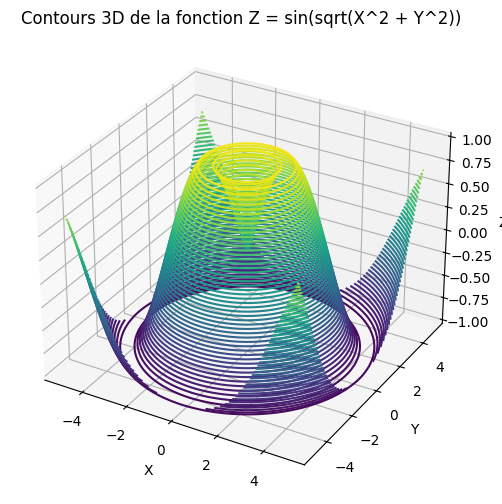

# Institut Universitaire des Sciences - IUS

## Faculté des Sciences et Technologie - FST

### Rapport du Td1 Mathématiques

### Préparé par Robaldo BADIO

### Soumis au chargé de cours Ismael ST-AMOUR

#### Date Le 15 / 04 / 2025

Installation de Jupyter notebook





Écris un programme qui convertit un nombre décimal en hexadécimal en demandant à l'utilisateur de
saisir ce nombre.


```python
decimal = int (input ("Entrer un nombre décimal"))
hexad = hex(decimal)
print(f"{decimal} en hexadécimal est {hexad[2:].upper()}")
```

    Entrer un nombre décimal 344
    

    344 en hexadécimal est 158
    

Écris un programme qui convertit un nombre hexadécimal en décimal en demandant à l'utilisateur de
saisir ce nombre.


```python
hexad = input ("Entrer une valeur hexadécimal")
decimal = int(hexad, 16)
print(f"{hexad} en décimal est {decimal}")
```

    Entrer une valeur hexadécimal 3F
    

    3F en décimal est 63
    

Créer un fichier CSV dans Python, charger le et l'afficher


```python
import pandas as pd

data = {
"Nom": ["Naguiby", "Jameson", "Peterson", "Beatrice", "Yann"],
"Sexe": ["M", "M", "M", "F", "M"],
"Zone": ["Zoranje", "Monchil", "Siloe", "Bois Beuf", "Civadier"]
}

df = pd.DataFrame(data)

df.to_csv("etudiantL3.csv", index=False)
print("Fichier CSV créé avec succès !")
```

    Fichier CSV créé avec succès !
    


```python
df = pd.read_csv("etudiantL3.csv")
print(df.head())
```

            Nom Sexe       Zone
    0   Naguiby    M    Zoranje
    1   Jameson    M    Monchil
    2  Peterson    M      Siloe
    3  Beatrice    F  Bois Beuf
    4      Yann    M   Civadier
    

Créer grande base de données (5000+ lignes) aléatoires


```python
import pandas as pd
import numpy as np
from faker import Faker
fake = Faker()

n = 5000

data = {
'ID': np.arange(1, n+1), # ID de 1 à 5000
'Nom': [fake.name() for _ in range(n)], 
'Âge': np.random.randint(17, 65, size=n),
'Ville': [fake.city() for _ in range(n)],
'Email': [fake.email() for _ in range(n)],
'Date Inscription': [fake.date_this_decade() for _ in range(n)]
}

df = pd.DataFrame(data)

df.to_excel('grande_base_de_donnees.xlsx', index=False, engine='openpyxl')
print("Fichier Excel de 5000 entrées généré avec succès !")
```

    Fichier Excel de 5000 entrées généré avec succès !
    

Créer 3Graphes

Graphe1


```python
import matplotlib.pyplot as plt
# Données
x = [1, 2, 3, 4, 5]
y = [10, 20, 15, 25, 30]

plt.plot(x, y, marker='o', linestyle='-', color='r', label="Croissance")

plt.xlabel("Temps (jours)")

plt.ylabel("Valeur")
plt.title("Évolution de la valeur en fonction du temps")
plt.legend()

plt.show()
```


    

    


Graphe2


```python
categories = ["A", "B", "C", "D"]
valeurs = [20, 35, 30, 40]

plt.bar(categories, valeurs, color='green')
plt.xlabel("Catégories")
plt.ylabel("Valeurs")
plt.title("Comparaison des catégories")
plt.show()
```


    

    


Graphe3


```python
import matplotlib.pyplot as plt
import numpy as np
from mpl_toolkits.mplot3d import Axes3D
# Générer une grille pour X et Y
x = np.linspace(-5, 5, 100)
y = np.linspace(-5, 5, 100)
X, Y = np.meshgrid(x, y)
# Définir la fonction Z (par exemple, une surface sinusoïdale)
Z = np.sin(np.sqrt(X**2 + Y**2))
# Créer la figure et le subplot 3D
fig = plt.figure(figsize=(8, 6))
ax = fig.add_subplot(111, projection='3d')
# Tracer les contours 3D
ax.contour3D(X, Y, Z, 50, cmap='viridis')
# Ajouter des labels et titre
ax.set_xlabel("X")
ax.set_ylabel("Y")
ax.set_zlabel("Z")
ax.set_title("Contours 3D de la fonction Z = sin(sqrt(X^2 + Y^2))")
plt.show()
```


    

    

