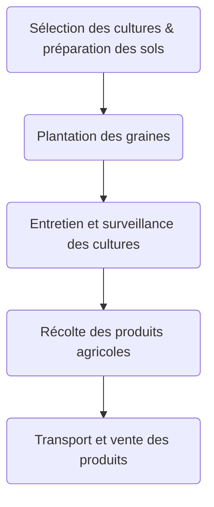

```mermaid
graph TD
    Préparation(Sélection des cultures & préparation des sols) --> Plantation(Plantation des graines)
    Plantation --> Croissance(Entretien et surveillance des cultures)
    Croissance --> Récolte(Récolte des produits agricoles)
    Récolte --> Distribution(Transport et vente des produits) 
```