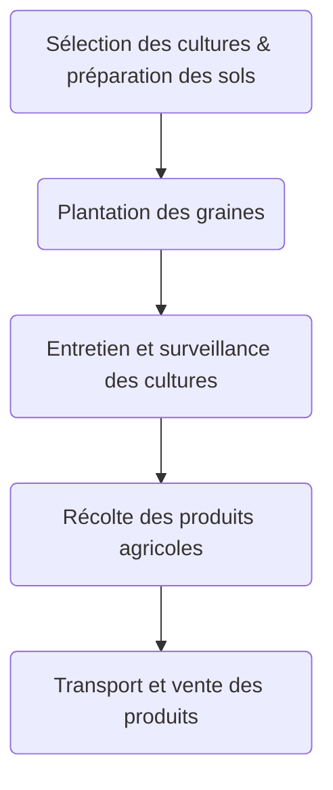

<div style="border:5px solid black; text-align:center">

# INSTITUT UNIVERSITAIRE DES SCIENCES - IUS
 


Faculté des Sciences et Technologie - FST


Niveau L3 Sciences Informatiques


NOM : BADIO

Prenom : Robaldo


Soumis au chargé de cours Ismael SAINT AMOUR


*Date: Vendredi 14 Mars 2025*
</div>

\newpage


# Créer un document avec des titres, du texte mis en forme, des listes, listes imbriquées, séparateurs, des liens, badges et en ajoutant une image

## L'Agriculture : Un Pilier Essentiel

### Introduction
L'agriculture est le fondement de la civilisation humaine, fournissant des ressources vitales telles que la nourriture, les matières premières et l'énergie. Elle joue également un rôle clé dans la préservation de l'environnement et le développement économique.

## Importance de l'Agriculture

### Avantages :
- Fournit de la nourriture pour la population mondiale.
- Crée des emplois dans les zones rurales.
  - *Pour réduire le taux de chômage.*
- Contribue à la stabilité économique des pays.

### Défis :
1. **Changement climatique** :
   - Affecte les rendements agricoles.
   - Modifie les régimes de précipitations.
2. **Déforestation excessive**.
3. **Déclin de la biodiversité**.

---

## Développement : Vers une Agriculture Durable

Pour répondre aux défis actuels, des innovations et approches modernes sont mises en œuvre :

- **Technologies agricoles** : Les drones, capteurs et outils d'intelligence artificielle permettent une gestion optimisée des ressources.
- **Pratiques écologiques** : Les cultures biologiques et l'agriculture de conservation réduisent l'impact environnemental.
- **Production hydroponique** : Une solution efficace pour cultiver dans les régions arides où le sol est limité.
- **Économie circulaire** : Le recyclage des déchets agricoles pour produire de l'énergie ou des fertilisants.

---

## Liens Utiles
- [Organisation des Nations Unies pour l'Alimentation et l'Agriculture (FAO)](https://www.fao.org)
- [Programme des Nations Unies pour l’Environnement (PNUE)](https://www.unep.org)

---

## Badges
[](https://www.fao.org)
[](https://www.fao.org)

---

## Images


## En Conclusion:
L'agriculture est à la fois une tradition millénaire et une science en constante évolution. Pour garantir un avenir durable, il est crucial d'adopter des pratiques modernes et respectueuses de l'environnement. La collaboration entre agriculteurs, scientifiques et décideurs politiques est essentielle.

## *Créer un tableau Markdown avec des données fictives et rédiger un texte avec citations*

| Année | Culture | Rendement (t/ha) | Coût de Production (Gdes/ha) | Profit (Gdes/ha) |
| ----- | ------- | ---------------- | ---------------------------- | ---------------- |
| 2020  | Blé     | 6.5              | 1200                         | 800              |
| 2021  | Maïs    | 8.2              | 1500                         | 1000             |
| 2022  | Riz     | 7.0              | 1400                         | 900              |
| 2023  | Fruits  | 5.8              | 1000                         | 700              |

# Texte explicatif avec citations

### Citations

- **2021 - Maïs :**  
  > *« Le maïs, avec un rendement de 8.2 t/ha et un profit de 1000 $/ha, démontre comment l'optimisation des pratiques agricoles peut maximiser la rentabilité. »* (Dupont, 2018)

- **2023 - Fruits :**  
  > *« Malgré des coûts de production faibles, les fruits reflètent les défis liés aux fluctuations du marché, avec un profit de seulement 700 Gdes/ha. »* (Martin et al., 2020)

- **2022 - Riz :**  
  > *« Avec un rendement stable à 7.0 t/ha, le riz illustre l'importance des céréales dans le maintien de la sécurité alimentaire mondiale. »* (FAO, 2022)

- **2020 - Blé :**  
  > *« Le blé, avec un profit de 1200 Gdes/ha, reste une culture clé pour soutenir l'économie rurale, bien que ses rendements puissent être affectés par les changements climatiques. »* (Jones et al., 2019)

## *Créer une liste de tâches à cocher, inclure un bloc de code avec une spécification de langage et inclure une syntaxe HTML.*

# Liste de tâches

- [x] Planifier le projet
- [ ] Réaliser l'analyse initiale
- [ ] Écrire le code
- [ ] Tester les fonctionnalités
- [ ] Rédiger la documentation

---

## Bloc de code avec spécification de langage (Python)
```python
def calculer_rendement(surface, production):
    """
    Calcule le rendement en tonnes par hectare.
    """
    try:
        rendement = production / surface
        return f"Le rendement est de {rendement:.2f} t/ha"
    except ZeroDivisionError:
        return "La surface ne peut pas être nulle."

# Exemple d'utilisation
surface = 5  # hectares
production = 35  # tonnes
print(calculer_rendement(surface, production))
```

<!DOCTYPE html>
<html lang="fr">
<head>
    <meta charset="UTF-8">
    <meta name="viewport" content="width=device-width, initial-scale=1.0">
    <title>Exemple HTML</title>
</head>
<body>
    <h1>Bienvenue dans l'agriculture moderne</h1>
    <p>Découvrez des innovations <strong>durables</strong> pour une meilleure gestion des cultures.</p>
    <ul>
        <li>Technologies agricoles</li>
        <li>Culture hydroponique</li>
        <li>Gestion durable des sols</li>
    </ul>
</body>
</html>

## *Créer un fichier Markdown incluant des tables des matières et ajouter un diagramme Mermaid dans un document.*

# Documentation sur l'Agriculture Durable

## Table des Matières
1. [Introduction](#introduction)
2. [Principes de l'Agriculture Durable](#principes-de-lagriculture-durable)
3. [Avantages](#avantages)
4. [Défis](#défis)
5. [Flux du Processus Agricole (Diagramme)](#flux-du-processus-agricole)
6. [Conclusion](#conclusion)

---

## Introduction
L'Agriculture durable vise à répondre aux besoins alimentaires actuels tout en préservant les ressources naturelles pour les générations futures.

---

## Principes de l'Agriculture Durable
- Maintien de la fertilité des sols.
- Réduction de l'utilisation des pesticides chimiques.
- Promotion de la biodiversité agricole.

---

## Avantages
- **Environnement** : Réduction des impacts environnementaux.
- **Économie** : Augmentation des revenus à long terme pour les agriculteurs.
- **Santé** : Production alimentaire plus sûre pour les consommateurs.

---

## Défis
- Les changements climatiques affectent la productivité.
- Manque d'accès à des technologies modernes dans certaines régions.
- Coûts initiaux élevés pour adopter des méthodes durables.

---

## Flux du Processus Agricole




## Conclusion

<div style="text-align: justify">

En conclusion, Ce Td nous ouvrent un esprit large et nou fait comprendre que: l'importance de Markdown et de Visual Studio Code dans la création de documents techniques et scientifiques ne peut être sous-estimée. Markdown permet de formater le texte de manière simple et claire, ce qui améliore la lisibilité et facilite la collaboration entre les membres d'une équipe. Visual Studio Code, avec ses fonctionnalités puissantes et ses extensions, offre un environnement de développement intégré qui simplifie la rédaction, l'édition et la prévisualisation de fichiers Markdown. En combinant les capacités de ces deux outils, on peut non seulement structurer l'information de manière efficace, mais aussi intégrer des éléments visuels tels que des images, des diagrammes et des tableaux. Ainsi, pour répondre aux besoins croissants de documentation et de partage d'informations, l'utilisation de Markdown avec Visual Studio Code représente une approche moderne et efficiente. Les étudiants et les professionnels peuvent bénéficier de cette synergie pour produire des documents de haute qualité, tout en assurant une présentation cohérente et esthétique.
</div>