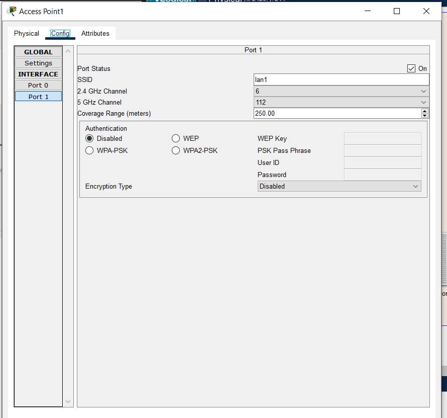
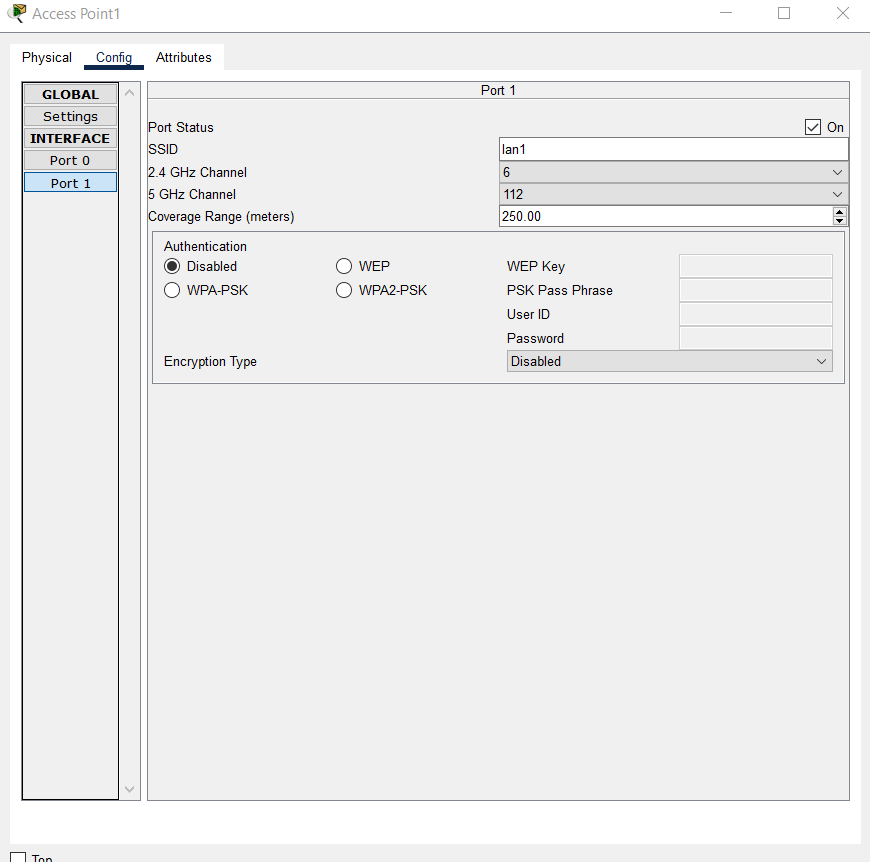
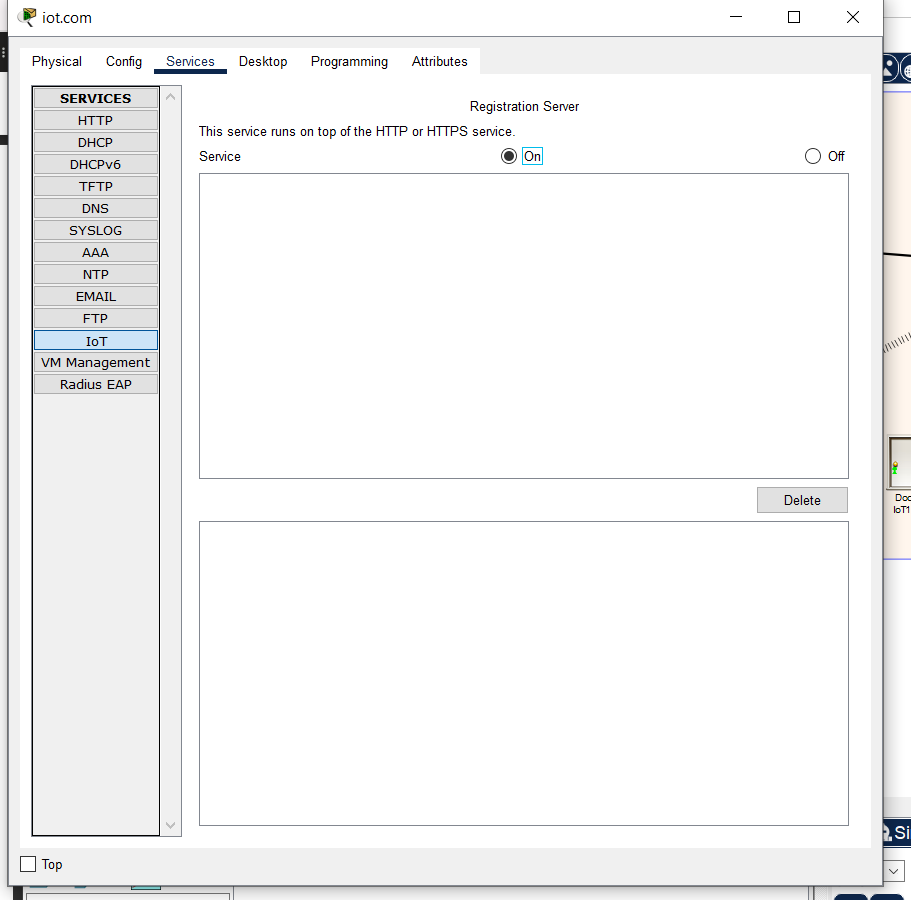
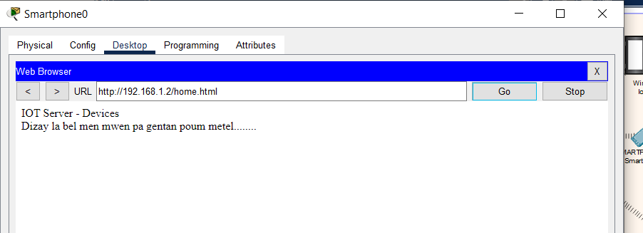

# **INSTITUT UNIVERSITAIRE DES SCIENCES**
# **IUS**

# **Faculté des Sciences et Technologie**
# **FST**

## Niveau L3 FST

## Rapport du TD4 dans le cadre du cours de Reseau 2

## Soumis au chargé de Cours **Ismael SAINT AMOUR**

## Préparé par **Robaldo BADIO**

#### *Date Le 28 Mars 2025*

\newpage

---
# **Rapport du TD4**
---
# Reproduisez cette topologie en configurant le NAT du réseau;

{width=700px}

## Configuration de NAT:
{width=700px}

{width=700px}

## Configuration du server dns
{width=700px}

{width=700px}

## Configuration du serveur DHCP sur le routeur Cisco
{width=700px}

## Vérifications des ip
{width=700px}

## Activités les services dns
{width=700px}
{width=700px}

## Configuration de NAT sur le routeur Cisco
{width=700px}

## Configuration de NAT dynamique (PAT)
{width=700px}

## Test de connectivité
{width=700px}

---
# Reproduisez cette topologie en configurant le réseau IoT (Internet des Objets);

## Configuration d’un réseau IoT (Internet des Objets)
{width=700px}

## Topologie du réseau 2
{width=700px}

## Configuration du point Acces
{width=700px}

## Activation des services IOT
{width=700px}

## Registration au server
{width=700px}

{width=700px}

## Configurer les IOT
{width=700px}
{width=700px}
{width=700px}
{width=700px}
{width=700px}
{width=700px}
{width=700px}

---
# Conclusion

Parmis les competences que j'ai pu avoir et les remarques, en terme de conclusion, je peux dire configurant le NAT dans une topologie réseau, on garantit un accès sécurisé et efficace aux ressources Internet tout en optimisant l’utilisation des adresses IP publiques, ce qui renforce la gestion et la connectivité globales. En parallèle, la mise en place d’une topologie IoT permet une communication fluide entre les objets connectés, essentielle pour l’automatisation des processus et l’analyse des données en temps réel. Ces deux configurations, bien qu’orientées vers des objectifs différents, illustrent l’importance d’adopter une architecture réseau adaptée, combinant performance, sécurité et flexibilité pour répondre aux besoins variés des utilisateurs tout en assurant une évolutivité à long terme.

